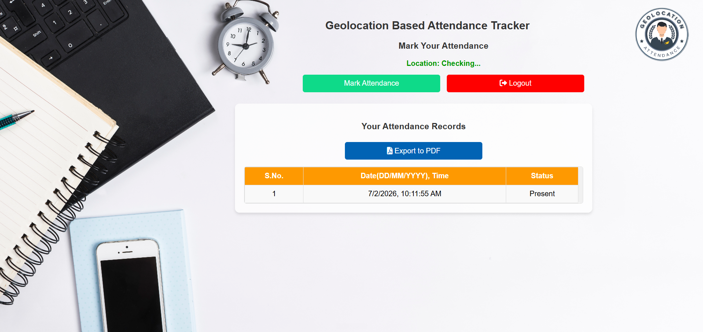
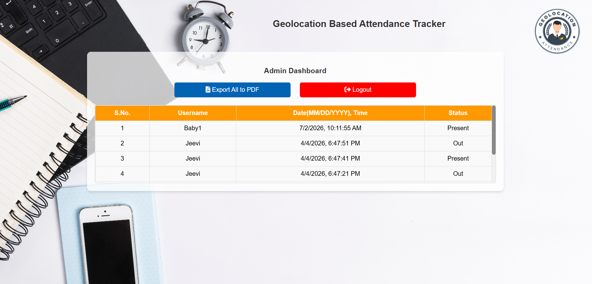

# 📍 GeoAttendance System

A modern web-based attendance system that combines **Face Recognition** and **Geolocation** to provide secure, reliable, and location-based attendance tracking.

---


---

## ✨ Overview

Traditional attendance systems can be manipulated through proxy attendance or remote check-ins. This project solves those issues by verifying both:

- 👤 User identity using Face Recognition
- 📍 User location using the Geolocation API

Attendance is marked only after successful verification.

---

## 🚀 Features

✅ Face Recognition Authentication

✅ Real-Time Geolocation Verification

✅ Secure Attendance Marking

✅ Clean & Responsive User Interface

✅ Fast Browser-Based Application

✅ Lightweight and Easy to Use

---

## 🛠️ Tech Stack

| Technology | Purpose |
|------------|---------|
| HTML5 | Structure |
| CSS3 | Styling |
| JavaScript (ES6) | Application Logic |
| Face API.js | Face Detection & Recognition |
| Geolocation API | User Location |

---

## 📂 Project Structure

```text
GeoAttendance-System/
│
├── images/
├── models/
├── index.html
├── style.css
├── script.js
└── README.md
```

---

## ⚙️ Getting Started

### Clone the Repository

```bash
git clone https://github.com/Jeevitha1718/GeoAttendance-System.git
```

### Navigate to the Project

```bash
cd GeoAttendance-System
```

### Run the Project

Open **index.html** in your browser.

> 💡 For camera permissions and better compatibility, use **VS Code Live Server**.

---

## 📸 Application Screenshots

### 👤 User Dashboard

The user can verify their location, mark attendance, view attendance records, and export attendance data as a PDF.



---

### 👨‍💼 Admin Dashboard

The admin can view all attendance records, monitor user status, and export the complete attendance report as a PDF.



---

## 🎯 Future Improvements

- 🔐 User Login Authentication
- 🗄️ Database Integration
- 📊 Attendance Reports
- 👨‍💼 Admin Dashboard
- ☁️ Cloud Deployment
- 📱 Mobile Responsive Version

---

## 📚 Learning Outcomes

This project helped me gain hands-on experience with:

- HTML5
- CSS3
- JavaScript
- Face Recognition
- Browser Geolocation
- DOM Manipulation
- Git & GitHub

---

## 📋 Prerequisites

Before running this project, make sure you have:

- A modern web browser (Chrome, Edge, or Firefox)
- Visual Studio Code (recommended)
- Live Server extension for VS Code
- Camera and Location permissions enabled

---

## 👩‍💻 Author

**Jeevitha**

- GitHub: https://github.com/Jeevitha1718
- Project: GeoAttendance System

---

## ⭐ Support

If you found this project useful, consider giving it a ⭐ on GitHub.

---

## 📄 License

This project is developed for educational and learning purposes.